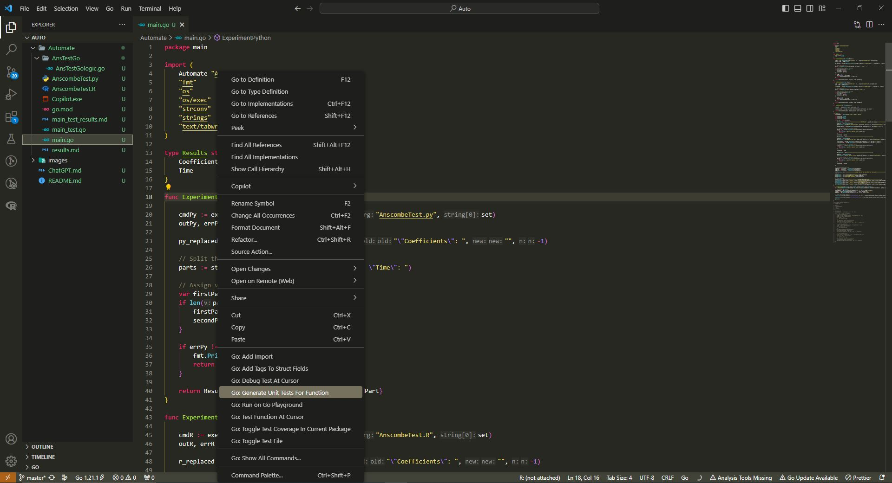
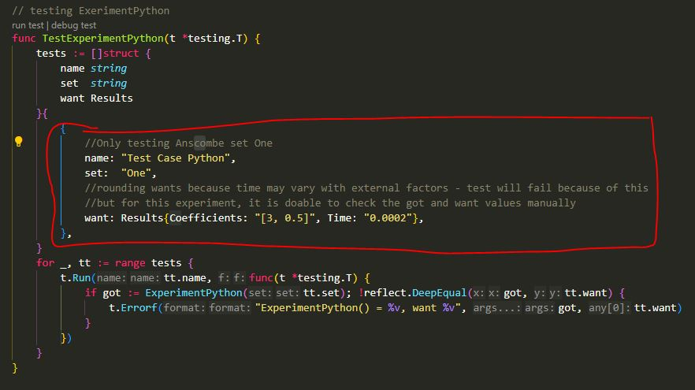

# Linear Regression Comparison with Automation

## The Problem
Return to an earlier project: Linear Regression Comparison and explore the possibilities of automated code generation using Github Copilot, the Go standard library, and ChatGPT.

I decided to see if I could take the same data from the original project, and meet the end goal requirements by using these automation methods. I wanted to essentially restart the project and see where the prompts would take me - start from ground zero and follow however the automation wanted to structure the solution, with as little manual fixes as possible. Can these programs/libraries hold up on their own? Can they ease the workload of devs enough to justify downsizing?

## The Original Project
https://github.com/MoriahI-NU/LinearRegressionComp  

## Automation Method 1: Github Copilot
URL: https://github.com/features/copilot  

I tried to code the main portion of this repo with Github Copilot. Below  is a list of the files, sections, and original prompts that utilized this automation method to help complete them.  

- AnsTestGologic.go - used Copilot to perform linear regression and output average coefficients and average runtime.  
Original Prompt - Copy AnscombeTest.py but convert it to golang

- main.go - used Copilot for the parts that generate outputs for each Anscombe set for each language.  
Original Prompt - Run AnscombeTest.py, AnscombeTest.R, and AnscombeTest.go for the first Anscombe set by using exec.Command and compare the average intercept, average slope, and average runtimes from each file. Then repeat with Anscombe sets 2, 3, and 4. (*Note that at this point in time, AnsTestGologic.go was of the form AnscombeTest.go)  
  
I kept the original Copilot code output at the end of these files, commented out for easy comparison so that you can see how much fiddling and adjustments I had to make. Many of these adjustments were also made with Copilot, asking it to fix errors or to tailor a specific section of the code. I found that there was a bit of a learning curve to Copilot. Sometimes even when asking for a small change that I thought was obvious, it would respond with something lengthy and out of left field.

## Automation Method 2: ChatGPT
URL: https://chat.openai.com  

I tried to use ChatGPT mainly for calculating the average runtimes for each language across all Anscombe sets, as well as for creating tables comparing the ratios of average runtimes. 
  
The conversation I held with this program can be found in ChatGPT.md. Personally I feel like ChatGPT understood my prompts better and had a shallower learning curve. However, it did have more issues with understanding the interconnectedness of my files at times. I had to consistently copy and paste parts of my code (from various sources) to give it a fuller picture of how everything worked together.

## Automation Method 3: Standard Library
URL: https://pkg.go.dev/std  
  
I used the standard library to create all unit tests in main_test.go. You can access this feature simply by right-clicking on the function you want to test from main.go and choosing the option "Go: Generate Unit Tests for Function" as seen below.

Here is a picture of the unit test that was generated. The part circled in red was the only part I had to manually add for this specific function test.

I thought that this option was fast and easy. It provides a sort of cookie cutter unit test with areas for you to fill in the specifics. This would definitely save time in typing the redundant parts of unit tests.

## Results

The results from the .exe file are found in results.md. The coefficients and runtimes match those from the original repo (within rounding error) - with the exeption of Go's runtimes. This is because although the .py and .R files are exactly the same (provided by NU SPS), I used Copilot to carry out the linear regression performed with Go. It chose a different method and structure than that used in the original Linear Regression Comparison.

The output from main_test.go is found in main_test_results.md. Although it says that everything FAILED, this is because I took some liberty with the "want" values. I knew that the runtimes would vary (very minutely) based on factors that I can't control, so I just put in a rough rounded number for everything - both the coefficients and the runtime. This project is small enough that I can manually check the main_test outputs to make sure that the outputs are NEAR ENOUGH to my want values.

## Insight and Recommendations 
I found that these methods of automation are indeed helpful and surprisingly intelligent. However, if used as the main method for a project like this they can create a solution that seems clunky and at times disorganized. As stated previously I tried to let Copilot/ChatGPT "take the lead" and follow most of its suggestions while doing as little manual input/fixes as possible. Even when tailoring my prompts time after time to get the most efficient and streamlined responses, I feel like the end product could still have been coded much more concisely. For specific blocks of code they are definitely helpful, but they don't always understand the entire picture of how files are interacting and what the end goal is. I think this is why I feel that this iteration is a bit disjointed compared to the original Linear Regression Comparison Repo. Perhaps I have not quite gotten the hang of wording my prompts correctly, but that goes to show how A. there IS a learning curve and B. automative processes as they are cannot replace people, they can only help make their jobs easier. To exactly what extent of time-saving measures automation provides should be studied and measured further if a company is thinking of downsizing. From my experience here, downsizing may be possible, but not by an incredible amount.